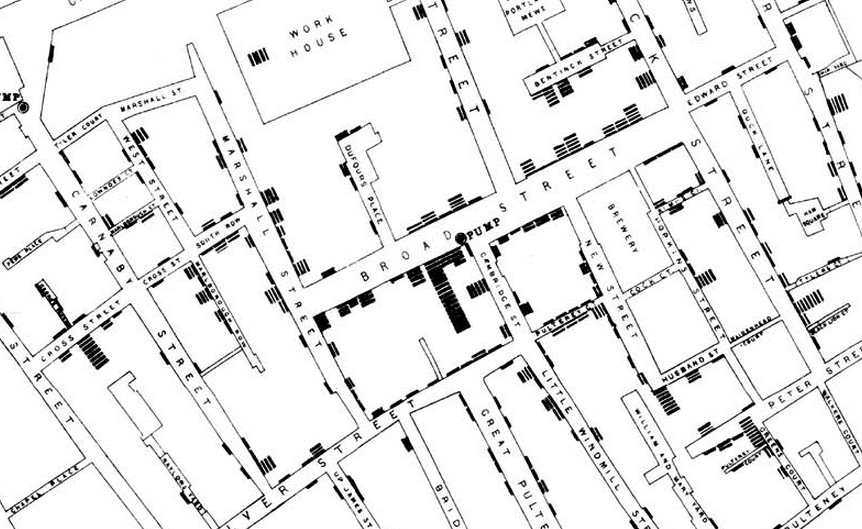
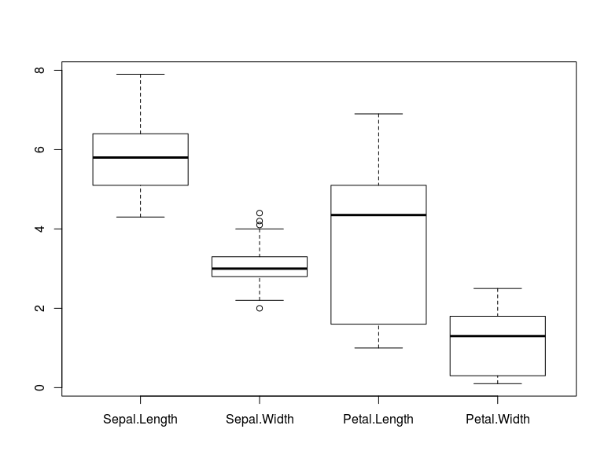
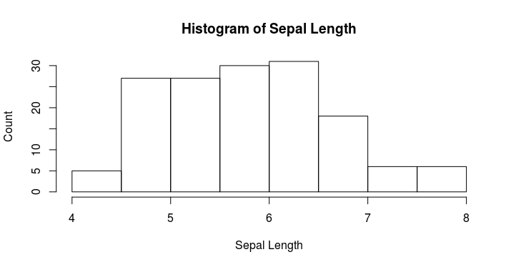
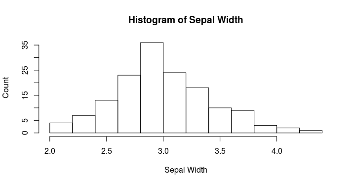
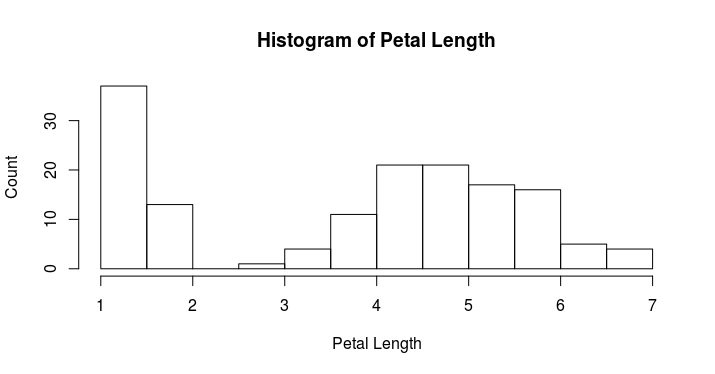
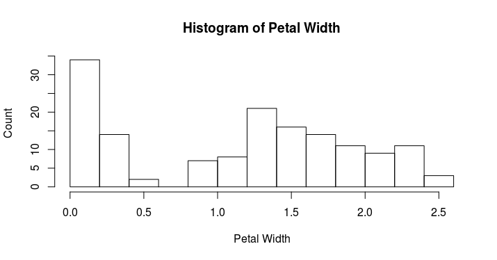

Data Visualization - Best Practices
========================================================
author: Pranay Aryal
autosize: true
transition: none
transition-speed: slow
font-family: 'Helvetica'
width: 1440
height: 900

John Snow example
=========================================================
title:false

The iris dataset
======================

Sepal Length | Sepal Width | Petal Length | Petal Width | Species
-------------|-------------|--------------|-------------|----------
5.1 | 3.5 | 1.4 | 0.2 | setosa
4.9 | 3 | 1.4 | 0.2 | setosa
5.7 | 2.8 | 4.5 | 1.3 | versicolor
4.9 | 2.4 | 3.3 | 1 | versicolor
6.5 | 3 | 5.8 | 2.2 | virginica
6.7 | 2.5 | 5.8 | 1.8 | virginica

<small>Data Visualization by John Snow</small>
<small>http://www.smalldatajournalism.com/class/fall2013/notes-1021/</small>

Definition
========================================================
  - Data visualization is story-telling.
  - It is a tool and not an end.
  - Used to drive action

Boxplots
===================================================

http://pranayaryal.github.io/boxplot

Histograms(getting counts)
==================================

Ranking Visual Encodings
====================================
  
  Property | Url
-----------|------
Position | http://pranayaryal.github.io/splom
Length | http://pranayaryal.github.io/d3
Slope | 
Angle | http://pranayaryal.github.io/piechart
  | http://pranayaryal.github.io/pietobar
Area | http://pranayaryal.github.io/area
Volume | 3D data visualizations do not have any extra advantage
Color-hue,saturation, density | http://bl.ocks.org/mbostock/raw/4060606/
 | http://pranayaryal.github.io/stackedbar
 
 
